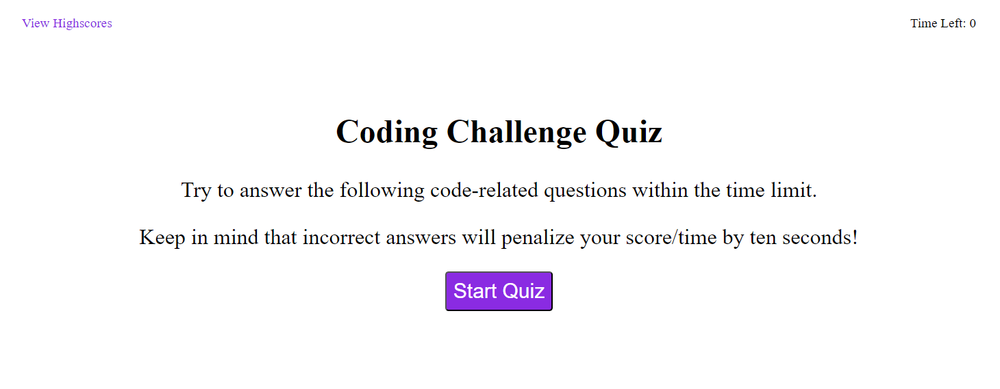

# code-quiz

## Description
This project was designed to help me advance my skills in JavaScript. I started with a mock-up of the desired look and functionality of the webpage. I learned how to apply advanced JavaScript skills to add, change, and remove html elements and their content, store and pull data from the local storage of the browser, use event listeners on buttons to add functionality to them, and how to use interval timers to delay specific code from executing.

## Usage
In this webpage, he "View Highscores" button in the top left will redirect to the highscores that are saved in local storage. Clicking the "Start Quiz" button will start the countdown clock and show the first question. Clicking the answer choices will display whether the question was answered correctly or incorrectly, then it will show the next question. There are a total of five questions and upon completion of the quiz, the webpage will ask for an input of your initials to add to the scoreboard. Once submitted, the webage will save the input and the score to local storage and then redirect to the highscores page.

## Screenshots

## Live Application
The link to the live application of the webpage is: https://coldnebraska.github.io/code-quiz/

## Source Code
The source code is located at the website https://github.com/coldnebraska/code-quiz
